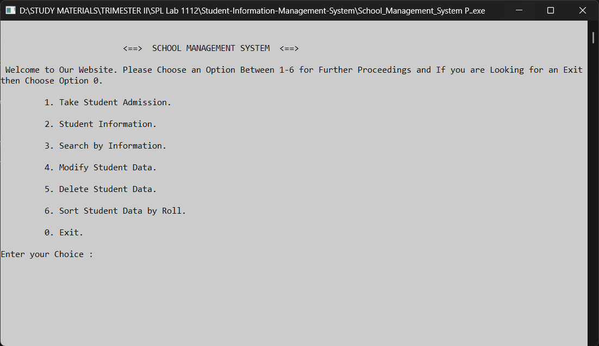
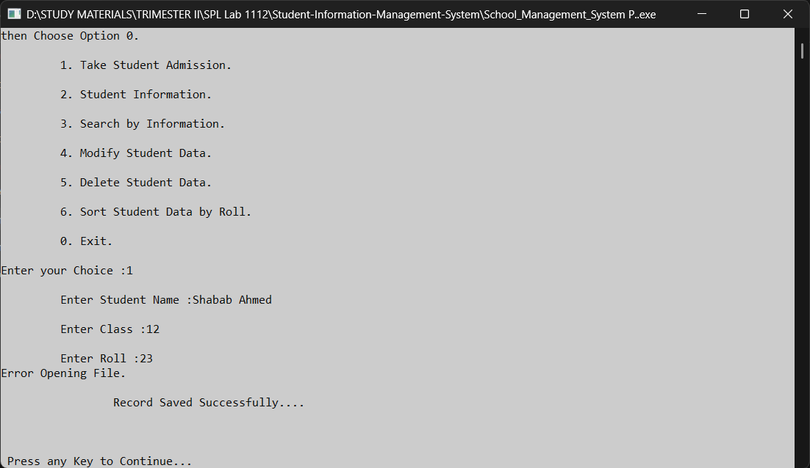
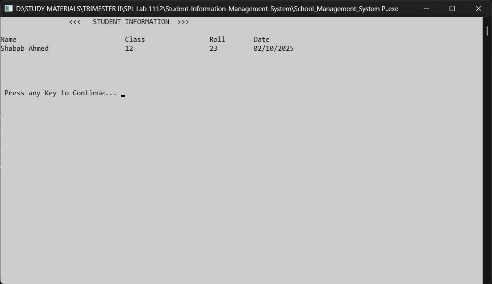

# Student-Information-Management-System
A structured programming (C) project from "CSE 1112: Structured Programming Language" laboratory.

# How to run 
`gcc main.c -o your_output_name`

# Project Demo
*Screenshots from **.exe** file*
<table>
  <thead>
    <tr>
      <th>Screenshots</th>
      <th>Descriptions</th>
    </tr>
  </thead>
  <tbody>
    <tr>
      <td></td>
      <td>Starting page</td>
    </tr>
    <tr>
      <td></td>
      <td>Taking student admission</td>
    </tr>
    <tr>
      <td></td>
      <td>Student Information</td>
    </tr>
  </tbody>
</table>